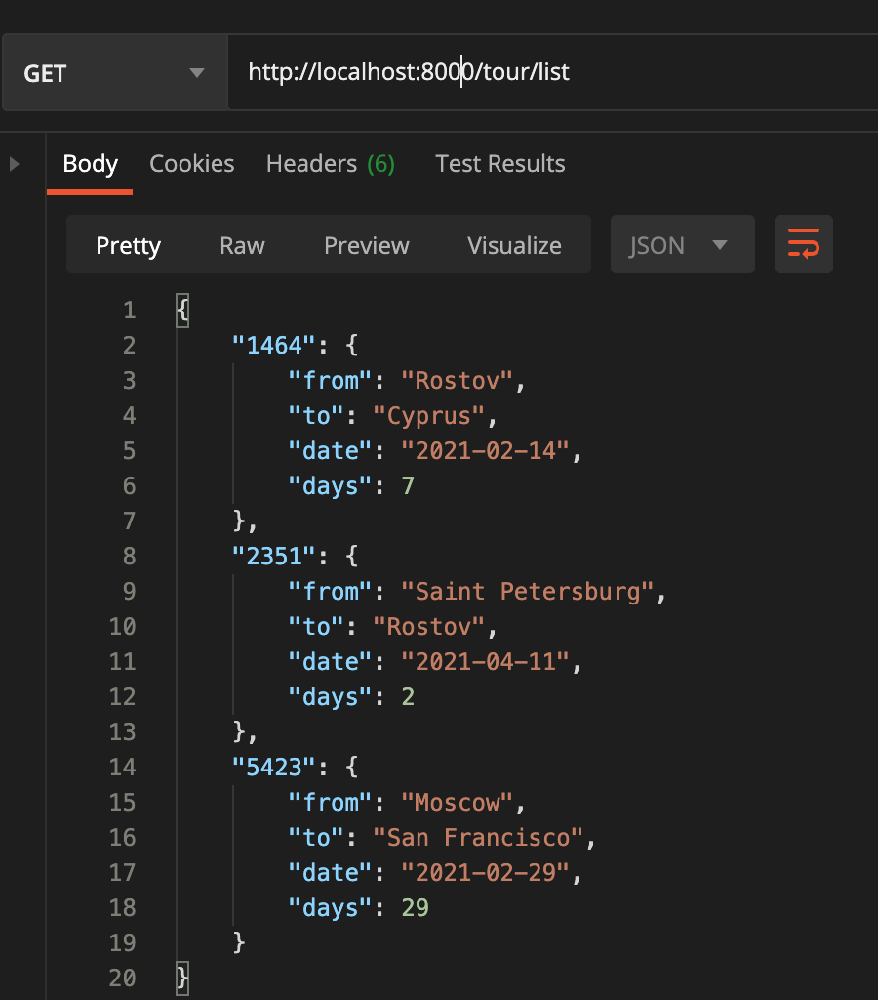
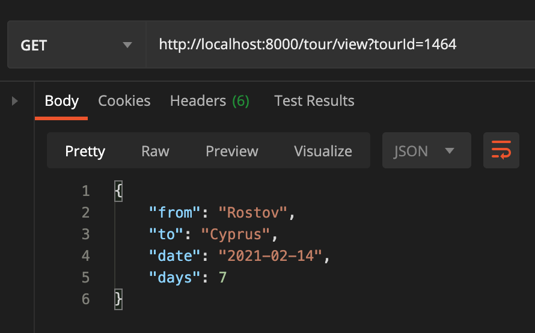
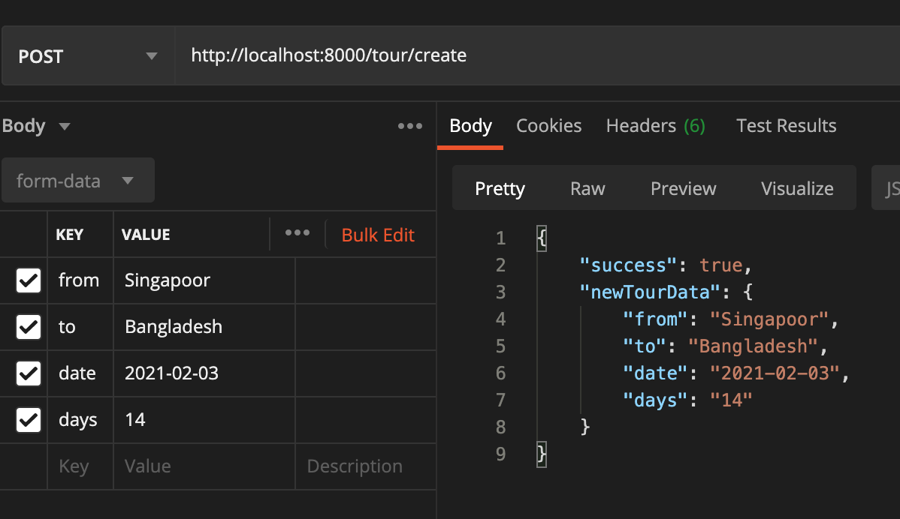

<p align="center">
    <a href="https://github.com/yiisoft" target="_blank">
        
    </a>
    <h1 align="center">Tour agency on Yii 2 Basic Project Template</h1>
    <br>
</p>

# Развертывание
У вас должен быть установлен docker и утилита docker-compose. Из корня проекта запустить команду:
```bash
$ docker-compose up -d
```

## Демо

```
GET /tour/list - Список туров
```


```
GET /tour/view?tourId={tourId} - Получение данных определенного тура
```


```
POST /tour/create - Создание записи нового тура
form-data:
    from - Город отправления (обязательное поле)
    to - Город прибытия (обязательное поле)
    date - Дата отъезда (обязательное поле)
    days - Продолжительность тура
```
